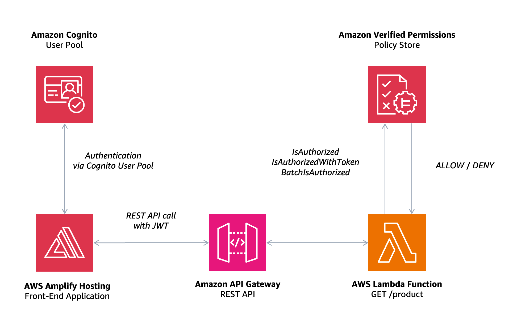

# Bookstore Demo Application with Authorization

## Context

This repository is the main asset for the [AWS re:Invent 2023](https://reinvent.awsevents.com) breakout session titled: "*Build verifiable and effective application authorization in 40 minutes*" ([BOA209](https://hub.reinvent.awsevents.com/attendee-portal/catalog/?search=boa209)).

It contains a sample application that demonstrates how you could add authorization layer using [Amazon Verified Permissions](https://aws.amazon.com/verified-permissions) and [Cedar](https://www.cedarpolicy.com/en) policy language. The backend as a serverless application, written in [Python](https://www.python.org) and exposed as a *REST API*, making use of [Amazon API Gateway](https://aws.amazon.com/api-gateway), [AWS Lambda](https://aws.amazon.com/lambda), and [Amazon Cognito](https://aws.amazon.com/cognito). The frontend is a [Vue.js](https://docs.amplify.aws/vue) application using the [AWS Amplify](https://docs.amplify.aws) SDK for authentication and communication with the provided *API*.

## Goal

As stated above, the goal of this application is to integrate an authorization (_AuthZ_ or _authz_) layer into a bookstore application, which already uses *Amazon Cognito* for authentication. The addition of *Amazon Verified Permissions (AVP)* with policies defined in *Cedar* language will allow you to enhance, maintain in an easier way, and reason about the authorization rules. The application itself is really a demo, as it is just listing books.

For integration of the *Amazon Verified Permissions (AVP)* with bookstore application, you need to define a set of test users with varying attributes and roles. These users will help you validate different authorization scenarios based on the policies defined in *AVP* and the user attributes managed by *Amazon Cognito*.

## Architecture & Design



### Overview of attributes inside Amazon Cognito User Pool Schema

In our bookstore application, you will use *Amazon Cognito* for managing user authentication. The user attributes in our *Cognito User Pool* are designed to support both the security and functionality of our application. Here's a brief overview of these attributes:

1. **ID**: `id`
   - **Description:** Every user has a unique ID, automatically generated by Cognito. This ID helps identify users distinctly.
2. **Email**: `email`
   - **Description:** Users register and sign in using their email addresses.
3. **Role**: `role`
   - **Description:** Users have assigned roles that define their access within the application. Here is list of available roles:
     - **Admin:** Has complete access to all books (premium offers, etc.).
     - **Publisher:** Can manage and view their own published books.
     - **Customer:** Can browse and purchase books.
4. **Years as Member**: `yearsAsMember`
   - **Description:** This attribute indicates how long a user has been a member of our service. It's used for offering specific features or content to loyal users.

### API Design

#### Product Service

```text
GET     /product                Returns details for all products (books).
GET     /product/{book_id}      Returns details for a single product (individual book).
```

### Authorization

You can review documentation for the authorization scenarios (including available roles and users), prepared *Cedar* policies, and *Policy Store* schema inside [docs](./docs/README.md) directory.

## Running the Example

Here you can find a list of the recommended prerequisites for this repository.

- Pre-installed tools:
  - Most recent *AWS CLI* (`2.13.37` or higher, [Installation Guide](https://docs.aws.amazon.com/cli/latest/userguide/getting-started-quickstart.html)).
  - Most recent *AWS SAM CLI* (`1.103.0` or higher, [Installation Guide](https://docs.aws.amazon.com/serverless-application-model/latest/developerguide/install-sam-cli.html)).
  - Node.js in version `20.9.x` or higher.
  - Python in version `3.10.x` or higher.
- Configured profile in the installed *AWS CLI* with credentials for your *AWS IAM* user account of choice.

### Setup steps

[Fork](https://github.com/build-on-aws/bookstore-demo-app-with-authz/fork) the GitHub repo, then clone your fork locally:

```shell
$ git clone https://github.com/<YOUR-GITHUB-USERNAME>/bookstore-demo-app-with-authz && cd bookstore-demo-app-with-authz
```

If you wish to use a named profile for your AWS credentials, you can set the environment variable `AWS_PROFILE` before running the below commands. For a profile named `development` it looks as follows `export AWS_PROFILE=development`.

You now have 2 options: you can deploy the backend and run the frontend locally, or you can deploy the whole project using the *AWS Amplify* console.

#### Option 1: Deploy backend and run frontend locally

##### Deploy the Backend

A new S3 bucket will be automatically created for you which will be used for deploying source code to AWS. If you wish to  use an existing bucket instead, you can manually set the `S3_BUCKET` environment variable to the name of your bucket.

Build and deploy the resources:

```bash
# After cloning it, inside the the repository root:

# Creates S3 bucket if not existing already, then deploys AWS CloudFormation stacks for authentication and product service.
$ make backend
```

##### Run the Frontend Locally

Start the frontend locally:

```bash
# After cloning it, inside the the repository root:

# Retrieves backend config from AWS SSM parameter store to a .env file, then starts service.
$ make frontend-serve
```

Once the service is running, you can access the frontend on `http://localhost:8080`.

You can create an account by clicking on "*Sign In*" then "*Create Account*". Be sure to use a valid email address as you'll need to retrieve the verification code sent by *Amazon Cognito*. Or, you can automate the whole process by using a script:

```bash
$ python manage-app-users.py                                      \
    --command create   # ... or delete, if you want to clean-up   \
    --cognito-user-pool-id "<COGNITO_USER_POOL_ID>"               \
    --email-prefix "your-first-part-of-the-email"                 \
    --email-postfix "domain.com"
```

**Note:** [CORS](https://aws.amazon.com/what-is/cross-origin-resource-sharing/#:~:text=Cross-origin%20resource%20sharing%20(CORS,resources%20in%20a%20different%20domain.) headers on the backend service default to allowing `http://localhost:8080`. You will see *CORS* errors if you access the frontend using the IP address (like `http://127.0.0.1:8080`), or using a port other than 8080.

##### Clean Up

Delete the AWS CloudFormation stacks created by this project:

```bash
# After cloning it, inside the the repository root:

$ make backend-delete
```

Keep in mind that there will be also one additional *Amazon S3* bucket created for storing code archives, also starting with a similar name: `bookstore-demo-app-with-authz-src-`.

#### Option 2: Automatically deploy backend and frontend using *Amplify Console*

[](https://console.aws.amazon.com/amplify/home#/deploy?repo=https://github.com/build-on-aws/bookstore-demo-app-with-authz)

1. Use **1-click deployment** button above, and continue by clicking "*Connect to GitHub*".
2. If you don't have an *IAM Service Role* with administrative permissions, select "*Create new role*".
   - If you already have that, you can jump directly to the 5th step.
3. Select "*Amplify*" from the drop-down, and select "*Amplify - Backend Deployment*", then click "*Next*".
4. Click "*Next*" again, then give the role a name and click "*Create role*".
5. In the Amplify console and select the role you created, then click "*Save and deploy*".
6. Amplify Console will fork this repository into your *GitHub* account and deploy it for you.
7. You should now be able to see your app being deployed in the [Amplify Console](https://console.aws.amazon.com/amplify/home).
8. Within your new app in Amplify Console, wait for deployment to complete.
   - This should take approximately ~10-15 minutes for the first deploy.

##### Clean Up

Delete the AWS Amplify application and AWS CloudFormation stacks created by this project. There are 3 of them, with names starting with `bookstore-demo-app-with-authz-`.

## References

- [Amazon Verified Permissions - Documentation](https://docs.aws.amazon.com/verifiedpermissions/latest/userguide/what-is-avp.html)
- [Cedar Language Playground](https://www.cedarpolicy.com/en/playground)
- [Cedar Policy GitHub Organization](https://github.com/cedar-policy)
- [Cedar Policy Langauge - Documentation](https://docs.cedarpolicy.com)
- [Cedar Policy Language - Best Practices](https://docs.cedarpolicy.com/bestpractices/bp-naming-conventions.html)
- [AVP CLI Tool](https://github.com/Pigius/avp-cli) by [Daniel Aniszkiewicz (Pigius)](https://github.com/Pigius)
- Blog posts series [Authorization and Cedar/Amazon Verified Permissions](https://dev.to/aws-builders/authorization-and-cedar-a-new-way-to-manage-permissions-part-i-1nid) by [Daniel Aniszkiewicz (Pigius)](https://dev.to/pigius)

## License

This library is licensed under the MIT-0 License. See the [LICENSE](LICENSE) file.
